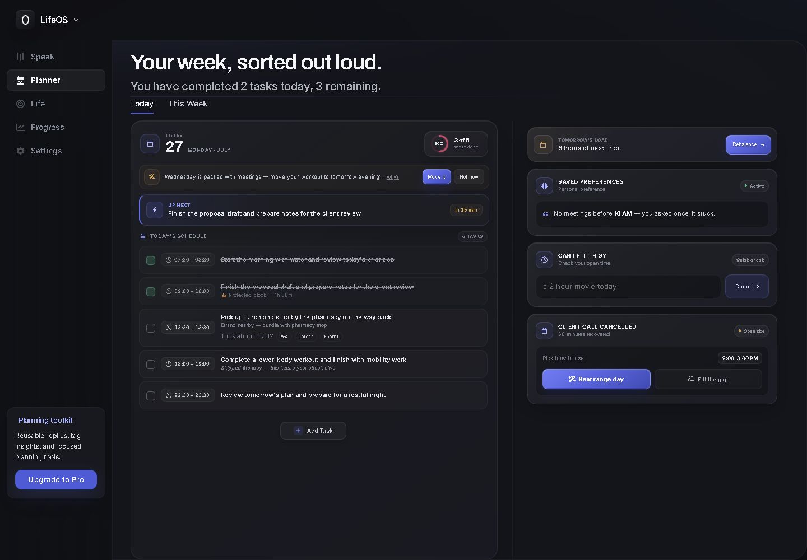
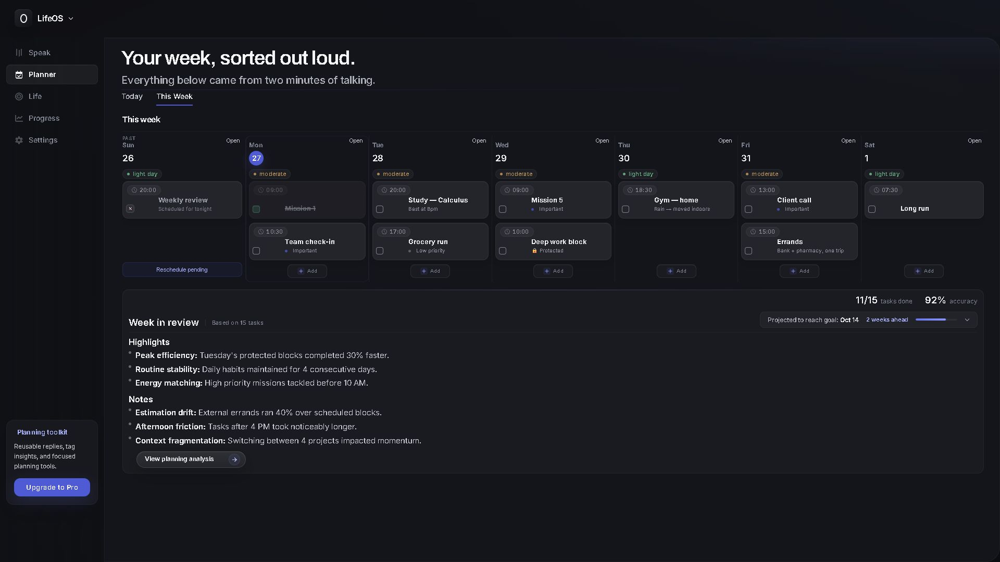

# LifeOS Productivity Dashboard

LifeOS is a desktop-focused planning interface that explores daily task management, weekly scheduling, progress visibility, rescheduling, and browser-local preferences in a self-contained application.

> Portfolio concept: LifeOS is a front-end demonstration. Tasks and settings remain local to the browser and are not synchronized with a production account.

## Project overview

**Goal:** Bring daily execution, weekly planning, and progress feedback into one information-dense workspace.

**My role:** Interface design, HTML/CSS/JavaScript implementation, interaction states, motion behavior, accessibility details, and documentation.

**Outcome:** A self-contained planner demonstration with task interactions, schedule feedback, theme persistence, and focused Today and Week views.

## Screenshots

| Today view | Weekly planning |
| --- | --- |
|  |  |

## Key functionality

- Daily and weekly planning views
- Task creation, editing, completion, and rescheduling interactions
- Progress, workload, and projection feedback states
- Theme preference stored locally in the browser
- Keyboard-accessible dialogs and explicit unavailable-feature messaging
- Reduced-motion support for users who request it

## Architecture and decisions

- The project is intentionally self-contained in `index.html` so it can be reviewed without a build system.
- Browser-local state and deterministic demonstration data keep the experience safe to explore.
- The layout prioritizes dense desktop planning workflows; smaller screens receive an explicit availability notice instead of a degraded interface.
- Automated integrity tests check required semantics, identifier uniqueness, and portfolio-language constraints.

## Technology

- Semantic HTML
- CSS custom properties and responsive states
- Vanilla JavaScript
- Browser local storage
- Node test runner for source integrity

## Run locally

Serve `index.html` with any local static server. For example:

```bash
npx serve .
```

## Quality checks

```bash
npm test
```

GitHub Actions runs the integrity checks for every pushed branch and pull request.

## Assets and reuse

See [ASSETS.md](ASSETS.md) for asset notes and [LICENSE](LICENSE) for reuse terms.
